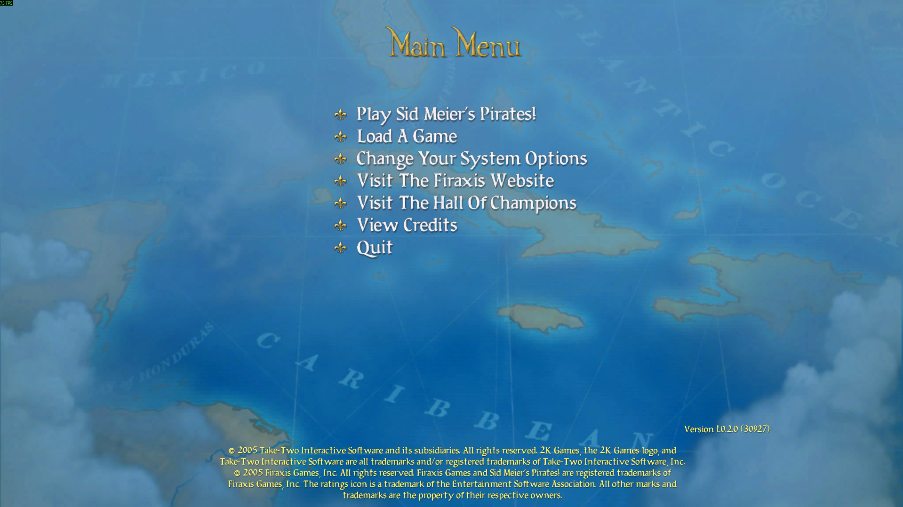
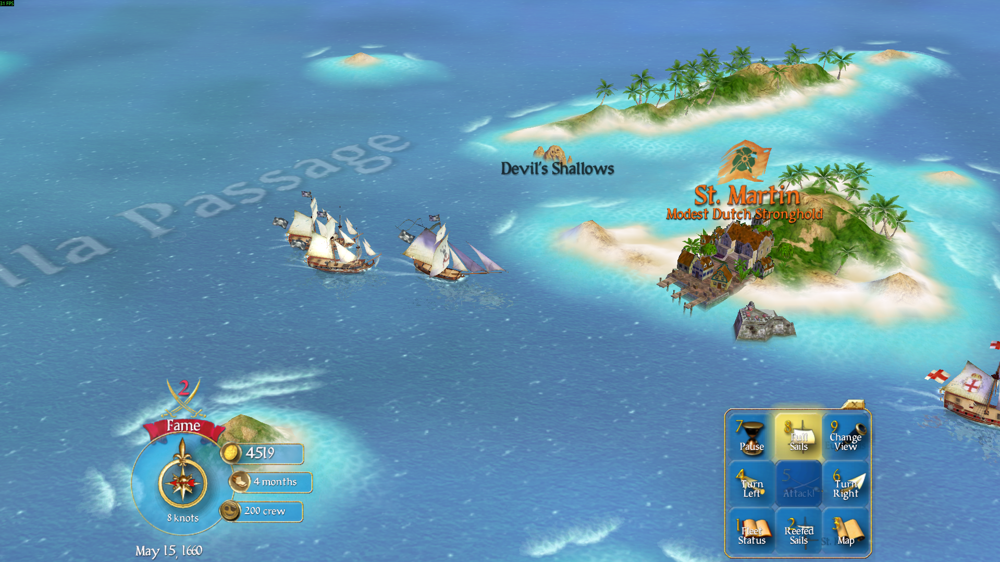
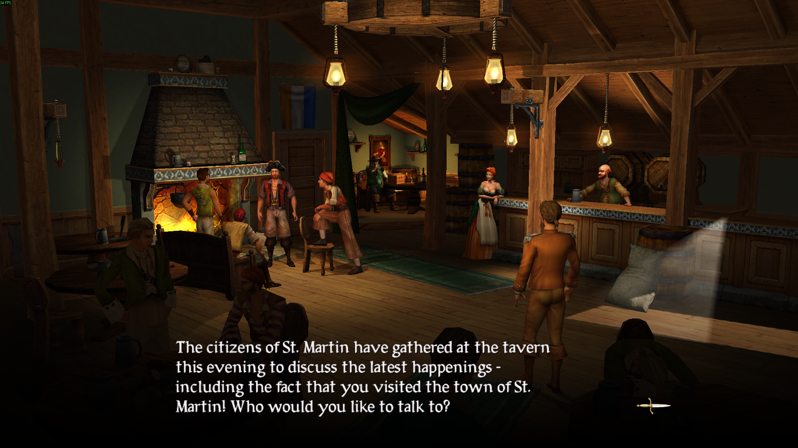
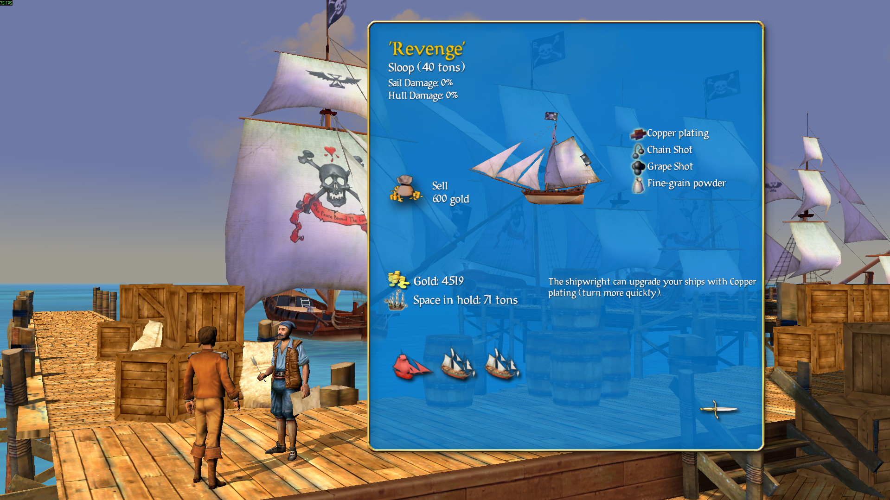
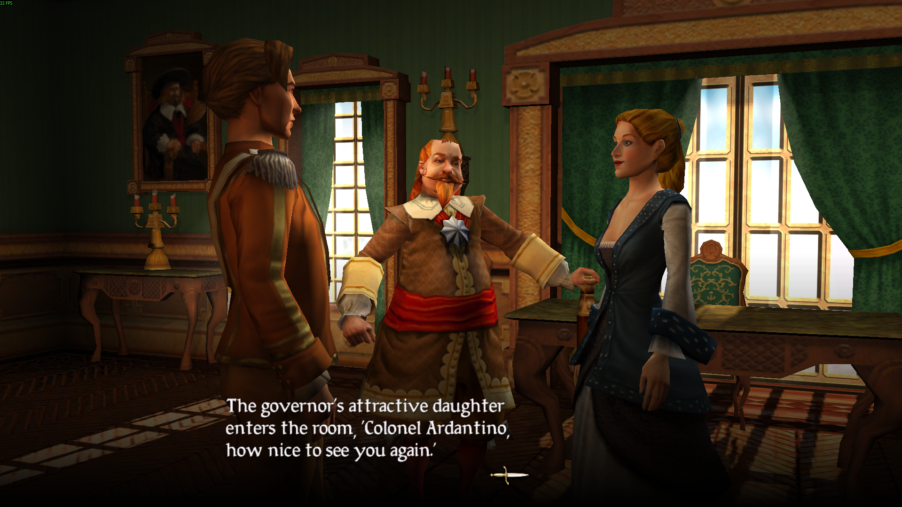
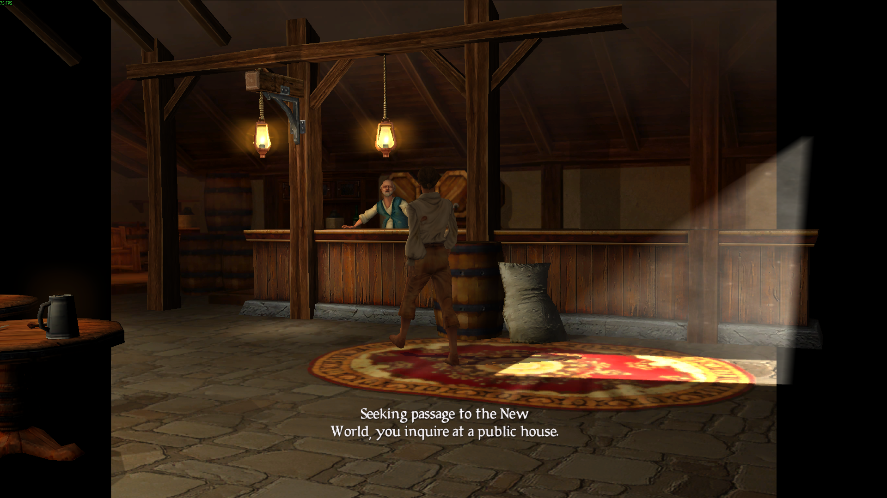

# Sid Meier's Pirates! (2005) - Full HD Widescreen Library (v0.22)

> **Steam Windows Release** | [Steam Store Page](https://store.steampowered.com/app/3920?snr=5000_5100__)  
> **Author:** Ref/Crs (2026)  
> **Type:** Non-intrusive runtime hook (EXE is never modified)

---

> **Disclaimer:** Provided **AS-IS** with **NO WARRANTY**. Use at your own risk.

---

## Download
Download from releases section on the right

## 🛠️ How to Install

1. **Set resolution:** Launch the game, set your video resolution to **1440x1080**, and exit game.  

2. **Copy DLL and config:** Place `winmm.dll` and `PiratesWide.ini` into your root game directory alongside `Pirates!.exe`.  
   *Example path:* `<YourSteamLibrary>\steamapps\common\Sid Meier's Pirates!\`

3. **Copy asset(s):** Place `titleScreen.dds` inside the `Assets\` folder (alongside the `.fpk` files).  

4. **Play:** Launch the game through Steam. It will now run in **Full HD 1920x1080**.

---

## 🗑️ How to Uninstall

Simply delete `winmm.dll`, `PiratesWide.ini`, and the added title screen `.dds` file(s) from your game directory.  
Deleting `winmm.dll` completely disables the hook and restores default game behavior.

---

## ⚙️ Recommended Settings

* **Advanced Lighting:** Recommended to turn **OFF** to avoid minor rendering glitches.
* **Other Graphics:** Max out all other visual settings.
* **Target Resolution:** This patch is designed specifically for **1920x1080**.
* **Testing:** Tested via a complete campaign playthrough. While fully playable end-to-end, minor visual quirks may occur due to the age of the engine.

### Known Issues

1. **Scene Transitions:** Minor scaling glitches may be noticeable during transition screens.
2. **4:3 Background Assets:** Certain pre-rendered backgrounds were originally designed for a 4:3 aspect ratio, leading to visible empty space on widescreen setups. This primarily impacts a few early intro/cutscene moments and was intentionally kept untouched.
3. **Sharp GUI vs. Minor Quirks:** Priority was strictly given to keeping UI elements, fonts, and dialogue text crisp and pixel-perfect rather than soft-scaled or blurry. A few minor visual artifacts result from this trade-off, but readable text was favored over complete asset stretching.

---

## 🔍 How It Works

The game relies on Windows' legacy multimedia library (`winmm.dll`) for audio. Because Windows applications prioritize local DLLs over system directories by default, dropping a custom `winmm.dll` next to `Pirates!.exe` ensures our wrapper loads first. 

The custom DLL acts as a proxy:
- Transparently forwards legitimate audio/system calls to the official Windows `winmm.dll`.
- In-memory patches the game's camera and viewport offsets at runtime to natively support 16:9 1920x1080 rendering without altering a single byte of the original binary on disk. No injection, no patching.

---

## 🔐 Verified Hashes (SHA-256)

| Target / File | Size (Bytes) | SHA-256 |
| :--- | :--- | :--- |
| **Pirates!.exe** (Steam Build 21031) | Provided by steam | `5342209c16ea847fa6ac9b90f25a20b46012aef24d1b5f8a7c7facdfe174e2e7` |
| **winmm.dll** | `163,328` | `d992923768c1d62d3d83213c82f722057ec3e459488fcef83d7acab49d40e363` |
| **Assets/titleScreen.dds** | `8,388,736` | `16e00cd05f88baab6964f02d6d6b6d77d584e5abe98e0a30e8474dc7ce3b80c5` |

## Screenshots

## 📸 Screenshots

